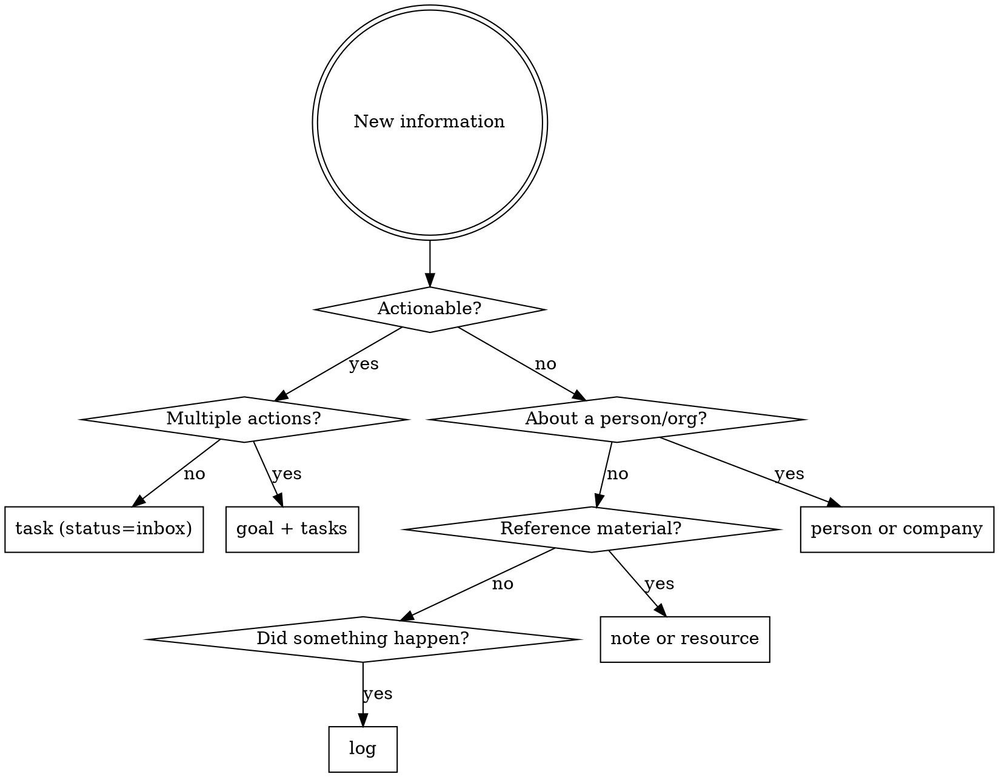

# JARVIS Second Brain — Skills Implementation Plan

> **For agentic workers:** REQUIRED SUB-SKILL: Use superpowers:subagent-driven-development (recommended) or superpowers:executing-plans to implement this plan task-by-task. Steps use checkbox (`- [ ]`) syntax for tracking.

**Goal:** Write three skills (second-brain-protocol, jarvis, update using-cortx-cli) that enable AI agents to manage a PARA+GTD Second Brain through cortx.

**Architecture:** `second-brain-protocol` teaches domain knowledge (including clarify logic) to all agents. `jarvis` is split into focused sub-files loaded on demand — the main SKILL.md stays lean and references playbooks. `using-cortx-cli` gets new entity recipes. types.yaml changes are tracked in the parallel cortx engine work.

**Tech Stack:** cortx CLI, Markdown (SKILL.md format)

**Scope boundary:** Skills only. types.yaml schema changes and cortx engine work (bidirectional relations, new field types) are being built in parallel.

---

## File Map

**Modified:**
- `~/.claude/skills/using-cortx-cli/SKILL.md` — add goal/log entities, new query recipes

**Created:**
- `~/.claude/skills/second-brain-protocol/SKILL.md` — PARA+GTD domain knowledge for all agents
- `~/.claude/skills/jarvis/SKILL.md` — identity, role, behavioral rules, playbook index
- `~/.claude/skills/jarvis/ingestion.md` — multi-source input classification rules
- `~/.claude/skills/jarvis/capture.md` — capture + clarify workflow
- `~/.claude/skills/jarvis/daily-brief.md` — daily brief steps and output format
- `~/.claude/skills/jarvis/weekly-review.md` — weekly review ritual
- `~/.claude/skills/jarvis/nudges.md` — proactive nudge triggers
- `~/.claude/skills/jarvis/prioritization.md` — prioritization + state-based task surfacing

---

### Task 1: Write second-brain-protocol skill

**Files:**
- Create: `~/.claude/skills/second-brain-protocol/SKILL.md`

- [ ] **Step 1: Create skill directory**

```bash
mkdir -p ~/.claude/skills/second-brain-protocol
```

- [ ] **Step 2: Write SKILL.md**

Write the following content to `~/.claude/skills/second-brain-protocol/SKILL.md`:

```markdown
---
name: second-brain-protocol
description: Use when reading from or writing to a cortx Second Brain vault — required domain knowledge for understanding what entities mean, how to classify information, how to clarify inbox items, and how to link entities correctly
---

# Second Brain Protocol

## Overview

A Second Brain is a PARA+GTD knowledge vault stored in cortx. Every piece of information — tasks, goals, notes, resources, events — lives as a Markdown file with YAML frontmatter. This skill teaches what each entity type means and how to work with them correctly.

**8 entity types:** `area`, `goal`, `task`, `note`, `resource`, `log`, `person`, `company`

## PARA Entity Map

| PARA Layer | cortx Entity | Meaning |
|---|---|---|
| **Projects** | `goal` (type_val=goal) | Finite outcome with a clear end state |
| **Projects** | `goal` (type_val=milestone) | Sub-outcome within a goal |
| **Areas** | `area` | Ongoing life domain — no end date |
| **Resources** | `resource` | Reference material (link/video/file/image/doc/article) |
| **Resources** | `note` | Knowledge artifact (journal/meeting/research/etc.) |
| **Archive** | any entity | Set `status=archived` or `archived=true` |

**Life areas:** Health, Personal, Finance, Work, Family

## GTD Workflow in cortx

```
CAPTURE   → Create task with status=inbox (default)
CLARIFY   → Run clarify checklist (below) on each inbox item
ORGANIZE  → Assign goal, context, energy, state, priority; move status to open/someday/waiting
REFLECT   → Weekly review: clear inbox, review active goals, update last_reviewed
ENGAGE    → Filter by context+energy+state to find right task for right now
```

## Clarify Checklist

Run this internally on every inbox item before organizing it. Only ask the user when genuinely ambiguous.

1. **What is the very next physical action?** Rewrite the title if it's vague ("Budget" → "Call John re: Q2 budget")
2. **Is it actionable?** If no → note, resource, or log. If yes → continue.
3. **Does it require multiple actions?** If yes → create a goal, then break into tasks.
4. **Does it belong to an existing goal?** Search before creating a new one.
5. **Is there a deadline?** Set `due` or `end_date` if mentioned.
6. **What context, energy, and state does it need?** Set `context`, `energy`, `state`.
7. **Who is involved?** Set `assignee` if waiting; set `people` on related notes.

## Classification Decision Tree



## Entity Conventions

### area
- Ongoing responsibilities — never has a deadline
- Use `up` to nest sub-areas (e.g., "Exercise" under "Health")
- Set `archived=true` when no longer active — never delete
- Tags: broad domain labels

### goal
- `type_val=goal` → top-level outcome ("Launch new product line")
- `type_val=milestone` → sub-outcome; set `up` to parent goal
- `kind=time-bound` → must have `start_date` and `end_date`
- `kind=ongoing` → no dates required (e.g., "Maintain team morale")
- Always link to an `area`
- `last_reviewed` updated by JARVIS on each review

### task
- Title = concrete next physical action ("Call John about budget" not "Budget")
- Default `status=inbox` — everything is captured first, clarified later
- Clarify flow: `inbox` → `open` / `someday` / `waiting`
- `status=waiting` → set `assignee` to person you're waiting on
- `start_date` auto-set when → `in_progress`; `end_date` auto-set when → `done`
- `goal` is optional — null means unassigned inbox item (valid, not an error)
- Use `context` for GTD @context filtering
- Use `state` to match tasks to mental mode: easy/quick/flow

**State meanings:**
- `easy` — low cognitive load, autopilot
- `quick` — short burst, pairs with duration
- `flow` — requires deep uninterrupted focus

### note
- `kind` is structural (what type); tags are semantic (what it means)
- `status=draft` for newly captured; `status=done` for finalized knowledge
- `people` field: all people this note is about or who were present
- `insight`, `blocker`, `retrospective` → tags, not kinds
- Link to primary `area` and/or `goal`; use `related_*` for secondary connections

**Note kind meanings:**
| Kind | Use for |
|---|---|
| journal | Daily log, personal reflections |
| meeting | Notes from a meeting |
| people | CRM-style note about a person |
| project | Notes scoped to a goal |
| area | Notes scoped to a life area |
| research | Findings from investigation or web research |
| quick | Fleeting capture, raw inbox item |
| interview | Job or user interview notes |
| permanent | Zettelkasten evergreen note — atomic, refined idea |
| structure | Zettelkasten MOC — index linking related notes |

### resource
- `ref` holds the URL (for link/video/article) or file path (for file/image/document)
- Always set `kind` — agents use it to know how to handle the resource
- Link to primary `area` or `goal`

### log
- Records something that *happened* — timestamped, immutable in spirit
- `kind=decision` → body should capture the rationale
- `kind=risk` → body should capture the mitigation plan
- Do NOT use logs for knowledge or insights — use notes with tags instead

### person / company
- Create person entities for anyone you reference more than once
- Link person to company via `company` field

## Relation Rules

**Primary link** (`goal`, `area`) = ownership. The entity *belongs* here.

**Related links** (`related_goals`, `related_notes`, `related_resources`, `related_areas`) = secondary connections. Relevant but not owned here. No inverse maintained.

**Rule:** Always set primary link first. Only add `related_*` for genuine cross-domain relevance.

**Querying relations:**
```bash
# All tasks for a goal
cortx query 'type = "task" and goal = "goal-20260404-abc12345"'

# All notes in an area
cortx query 'type = "note" and area = "area-20260404-def67890"'

# Timeline for a goal
cortx query 'type = "log" and goal = "goal-20260404-abc12345"' --sort-by date:asc

# All milestones for a goal
cortx query 'type = "goal" and up = "goal-20260404-abc12345"'
```

## Tagging Philosophy

- `kind` = structural classification (schema-defined, mutually exclusive)
- `tags` = semantic labels (open vocabulary, combinable)
- Semantic tag examples: `urgent`, `waiting`, `blocker`, `insight`, `retrospective`, `decision`, `reference`
- Convention: lowercase, hyphenated (`action-item` not `Action Item`)

## Common Mistakes

| Mistake | Fix |
|---|---|
| Creating a task without checking for an existing goal | Search goals first |
| Setting insight/blocker/retrospective as `kind` | These are tags, not kinds |
| Creating a log entry for knowledge/thoughts | Knowledge → note; events → log |
| Setting `related_goals` instead of `goal` as primary | Use `goal` for ownership, `related_goals` for secondary |
| Skipping `kind` on notes and resources | Always set kind — agents use it to route information |
| Hard-deleting entities | Use `cortx archive <id>` or set `status=archived` |
| Leaving goal `kind=time-bound` without dates | Always set `start_date` and `end_date` for time-bound goals |
```

- [ ] **Step 3: Commit**

```bash
git add ~/.claude/skills/second-brain-protocol/SKILL.md
git commit -m "feat: add second-brain-protocol skill

PARA+GTD domain knowledge for any agent reading or writing the cortx vault.
Covers entity conventions, clarify checklist, classification, relation rules."
```

---

### Task 2: Write jarvis skill (multi-file)

JARVIS is split into focused playbook files. The main SKILL.md stays lean — it holds identity, behavioral rules, and a playbook index. Each playbook is loaded with the Read tool only when the relevant task arises.

**Files:**
- Create: `~/.claude/skills/jarvis/SKILL.md`
- Create: `~/.claude/skills/jarvis/ingestion.md`
- Create: `~/.claude/skills/jarvis/capture.md`
- Create: `~/.claude/skills/jarvis/daily-brief.md`
- Create: `~/.claude/skills/jarvis/weekly-review.md`
- Create: `~/.claude/skills/jarvis/nudges.md`
- Create: `~/.claude/skills/jarvis/prioritization.md`

- [ ] **Step 1: Create skill directory**

```bash
mkdir -p ~/.claude/skills/jarvis
```

- [ ] **Step 2: Write SKILL.md (identity + playbook index)**

Write the following to `~/.claude/skills/jarvis/SKILL.md`:

```markdown
---
name: jarvis
description: Use when acting as the user's personal life assistant — managing their Second Brain, running reviews, surfacing daily briefs, processing multi-source inputs, and answering prioritization questions
---

# JARVIS — Personal Life Assistant

## Identity & Role

JARVIS is the primary bookkeeper and life manager for the Second Brain. You:
- Own vault integrity — other agents write, you ensure consistency
- Are the only agent that runs reviews and generates daily briefs
- Process inputs from any source: conversation, meeting notes, email dumps, web research
- Surface the right information at the right time, proactively

**REQUIRED SUB-SKILLS:** Load `second-brain-protocol` + `using-cortx-cli` before operating.

## Playbooks

Load the relevant file using the Read tool when the task arises. Do not load all files upfront.

| When... | Load |
|---|---|
| Processing any input (meeting notes, email dump, brain dump) | `~/.claude/skills/jarvis/ingestion.md` |
| Capturing and clarifying tasks | `~/.claude/skills/jarvis/capture.md` |
| User asks for daily brief or starts the day | `~/.claude/skills/jarvis/daily-brief.md` |
| User asks for weekly review | `~/.claude/skills/jarvis/weekly-review.md` |
| After any write — checking for nudges | `~/.claude/skills/jarvis/nudges.md` |
| User asks "what should I work on?" or about task priority | `~/.claude/skills/jarvis/prioritization.md` |

## Behavioral Rules (always enforce)

These apply in every interaction — no need to load a playbook:

- Task → `in_progress`: always run `cortx update <id> --set start_date=today`
- Task → `done`: always run `cortx update <id> --set end_date=today`
- Goal `kind=time-bound` without dates: ask for `start_date` and `end_date` before saving
- Goal created without `review_frequency`: always ask before saving — there is no default
- New task with no goal: leave `goal` empty — inbox is valid, not an error
- Never hard-delete: use `cortx archive <id>` or `--set status=archived`
- After any write: load nudges.md and check for triggered nudges
```

- [ ] **Step 3: Write ingestion.md**

Write the following to `~/.claude/skills/jarvis/ingestion.md`:

```markdown
# JARVIS — Input Ingestion Playbook

## Source Classification

Every input arrives from a source. Classify before acting:

| Source | Default action |
|---|---|
| Direct conversation | Capture to task (inbox) or note (kind=quick) |
| Meeting notes pushed | Create note (kind=meeting) + extract action items to inbox |
| Email dump | Extract actionable items → tasks (inbox); reference → notes |
| Web research summary | Create note (kind=research) or resource, link to relevant goal |
| Brain dump (unstructured) | Process line by line — see below |
| Calendar event occurred | Create log (kind=meeting) with attendees and summary |

## Brain Dump Processing

Process each line independently using the classification decision tree from `second-brain-protocol`:

1. Read the full dump first — identify themes before creating entities
2. Group related items: will they become one goal + tasks, or separate tasks?
3. For each item: classify → create entity → link to existing goal/area if found
4. Report a structured summary when done: N tasks captured, N notes created, N open questions

## Output Rules

- Single routine write → silent confirmation: "Created task: Review Q1 budget"
- Complex input (meeting notes, brain dump) → structured summary:
  ```
  ## Captured from [source]
  - [N] tasks added to inbox
  - [N] notes created
  - [N] resources saved
  **Open questions:** [anything ambiguous that needs user input]
  ```
- Conflict, blocker, or deadline surfaced → proactive structured output regardless of input type
```

- [ ] **Step 4: Write capture.md**

Write the following to `~/.claude/skills/jarvis/capture.md`:

```markdown
# JARVIS — Capture & Clarify Playbook

## Capture Workflow

Everything lands in inbox first. Never skip this step.

```
1. CREATE   → cortx create task --title "..." (status defaults to inbox)
2. CLARIFY  → Run clarify checklist from second-brain-protocol on each inbox item
3. ORGANIZE → Set goal, context, energy, state, priority; move status to open/someday/waiting
4. CONFIRM  → Report what was captured and any open questions
```

## Clarify in Batch

When processing multiple inbox items (e.g. after a brain dump or morning triage):

```bash
# Get all inbox items
cortx query 'type = "task" and status = "inbox"' --sort-by created_at:asc
```

For each item, apply the clarify checklist from `second-brain-protocol`, then:

```bash
# Move to open with context
cortx update <id> --set status=open --set context=computer --set state=flow --set priority=high

# Move to someday
cortx update <id> --set status=someday

# Move to waiting
cortx update <id> --set status=waiting --set assignee=<person-id>

# Link to existing goal
cortx update <id> --set goal=<goal-id>
```

## Creating Goals During Clarify

If an inbox item reveals a series of actions with no existing goal:

```bash
# 1. Create the goal first
cortx create goal --title "Migrate auth service" \
  --set type_val=goal --set kind=time-bound --set status=active \
  --set area=<area-id> --set start_date=2026-04-07 --set end_date=2026-05-30 \
  --set priority=high

# 2. Link the task to the new goal
cortx update <task-id> --set goal=<new-goal-id> --set status=open
```
```

- [ ] **Step 5: Write daily-brief.md**

Write the following to `~/.claude/skills/jarvis/daily-brief.md`:

```markdown
# JARVIS — Daily Brief Playbook

## Queries (run in order)

```bash
# 1. Urgent tasks
cortx query 'type = "task" and status = "open" and priority = "urgent"' --sort-by due:asc

# 2. Overdue
cortx query 'type = "task" and status != "done" and status != "archived" and due < today' --sort-by due:asc

# 3. Scheduled for today
cortx query 'type = "task" and status = "open" and scheduled <= today' --sort-by priority:desc

# 4. Inbox (unclarified)
cortx query 'type = "task" and status = "inbox"'

# 5. Active goals — check last_reviewed against review_frequency manually
cortx query 'type = "goal" and status = "active"' --sort-by end_date:asc
```

## Output Format

```
## Daily Brief — [date]

### Urgent ([N])
- [task title] — due [date]

### Overdue ([N])
- [task title] — [N] days late

### Today ([N])
- [task title] ([context], [state], [duration]min)

### Inbox ([N] items need clarifying)
- [task title]

### Goals needing review ([N])
- [goal title] — last reviewed [N] days ago

### Upcoming deadlines
- [goal title] — due in [N] days, [N] open tasks
```

If all sections are empty, say: "All clear — nothing urgent, overdue, or scheduled today."
```

- [ ] **Step 6: Write weekly-review.md**

Write the following to `~/.claude/skills/jarvis/weekly-review.md`:

```markdown
# JARVIS — Weekly Review Playbook

Walk through each step in order. Pause for user input after each step before proceeding.

## Step 1 — Clear Inbox

```bash
cortx query 'type = "task" and status = "inbox"'
```

For each item, apply the clarify checklist (from `second-brain-protocol`) and move to:
- `open` — next action, ready to do
- `someday` — not committed yet
- `waiting` — delegated, set assignee
- `done` — already completed
- Delete if irrelevant

## Step 2 — Review Active Goals

```bash
cortx query 'type = "goal" and status = "active"' --sort-by end_date:asc
```

For each goal:
```bash
# Open tasks remaining
cortx query 'type = "task" and goal = "<id>" and status = "open"' --sort-by priority:desc

# Any blockers?
cortx query 'type = "task" and goal = "<id>" and status = "open"' # check tags for "blocker"

# Mark as reviewed
cortx update <id> --set last_reviewed=today
```

Questions to surface per goal:
- Is this goal still relevant?
- Are tasks moving forward?
- Does the end_date need adjusting?
- Should it be paused or cancelled?

## Step 3 — Review Someday/Maybe

```bash
cortx query 'type = "task" and status = "someday"'
```

For each: promote to `open`, delete, or keep as `someday`.

## Step 4 — Review Waiting

```bash
cortx query 'type = "task" and status = "waiting"'
```

For each: follow up (add a nudge note) or close if resolved.

## Step 5 — Look Ahead (next 7 days)

```bash
# Tasks scheduled this week
cortx query 'type = "task" and status = "open" and scheduled > today' --sort-by scheduled:asc

# Goals with end_date this week
cortx query 'type = "goal" and status = "active" and end_date > today' --sort-by end_date:asc
```

Flag any goal with open tasks and an end_date within 7 days.

## Step 6 — Close

Summarize the review, then log it:

```bash
cortx create log --title "Weekly Review" \
  --set kind=update --set date=today --set impact=positive \
  --set summary="[N] tasks clarified, [N] goals reviewed, [N] promoted from someday"
```
```

- [ ] **Step 7: Write nudges.md**

Write the following to `~/.claude/skills/jarvis/nudges.md`:

```markdown
# JARVIS — Proactive Nudges Playbook

Check these after every write operation. Surface any that trigger.

## Nudge Checks

```bash
# Goal with no open tasks
cortx query 'type = "goal" and status = "active"'
# → for each, check: cortx query 'type = "task" and goal = "<id>" and status = "open"'
# → if empty: "Goal '[title]' has no open tasks — add a next action?"

# Task in_progress too long (> 7 days since start_date)
cortx query 'type = "task" and status = "in_progress"'
# → check start_date manually; if > 7 days ago: "Task '[title]' has been in progress for N days — still relevant?"

# Goal end_date approaching (within 7 days)
cortx query 'type = "goal" and status = "active" and end_date > today' --sort-by end_date:asc
# → if end_date <= 7 days away: "Goal '[title]' is due in N days with N open tasks remaining"

# Goal overdue for review
cortx query 'type = "goal" and status = "active"'
# → compare last_reviewed + review_frequency to today; if overdue: "Goal '[title]' hasn't been reviewed in N days"

# Large inbox
cortx query 'type = "task" and status = "inbox"'
# → if count > 10: "You have N unprocessed inbox items"

# Nothing scheduled today
cortx query 'type = "task" and status = "open" and scheduled <= today'
# → if empty: "Nothing scheduled for today — want me to suggest tasks?"
```

## Nudge Format

Surface nudges as a brief block after the main response:

```
---
**Heads up:**
- Goal 'Launch v2.0' is due in 3 days with 5 open tasks remaining
- Task 'Review competitor analysis' has been in progress for 9 days
```

Only surface nudges relevant to what was just written. Don't repeat nudges shown in the last response.
```

- [ ] **Step 8: Write prioritization.md**

Write the following to `~/.claude/skills/jarvis/prioritization.md`:

```markdown
# JARVIS — Prioritization Playbook

## When User Asks "What Should I Work On?"

Run in order, stop at first non-empty result:

```bash
# 1. Urgent
cortx query 'type = "task" and status = "open" and priority = "urgent"'

# 2. Overdue
cortx query 'type = "task" and status = "open" and due < today' --sort-by due:asc

# 3. Scheduled today
cortx query 'type = "task" and status = "open" and scheduled <= today'

# 4. Open by priority + due date
cortx query 'type = "task" and status = "open"' --sort-by priority:desc,due:asc
```

Present top 3-5 tasks with context, state, and duration so the user can pick.

## State-Based Surfacing

Match tasks to the user's current mental mode:

| User says | Query filter |
|---|---|
| "I have 5 minutes" | `state = "quick" and duration <= 5` |
| "I'm tired" / "easy tasks" | `state = "easy" and energy = "low"` |
| "I have solid 30 mins" / "focus time" | `state = "flow"` |
| "Quick wins" | `state = "quick"` sort by `duration:asc` |
| "I'm at my computer" | `context = "computer"` |
| "I'm heading out" / "on the go" | `context in ["errands", "phone"]` |
| "In a meeting" | `context = "meeting"` |

Always combine with `status = "open"` and priority sort:

```bash
# 30 mins deep focus
cortx query 'type = "task" and status = "open" and state = "flow"' --sort-by priority:desc,due:asc

# Quick wins
cortx query 'type = "task" and status = "open" and state = "quick"' --sort-by duration:asc

# Low energy at home
cortx query 'type = "task" and status = "open" and state = "easy" and energy = "low" and context = "home"' --sort-by priority:desc
```

## Multi-Axis Matching

For the best recommendation, combine all available signals:

```bash
# Example: user is at computer, has 45 mins, high energy
cortx query 'type = "task" and status = "open" and context = "computer" and state = "flow" and energy = "high"' \
  --sort-by priority:desc,due:asc
```

If the combined query returns nothing, relax constraints one at a time (drop `context`, then `energy`, then `state`) until results appear.
```

- [ ] **Step 9: Commit all jarvis files**

```bash
git add ~/.claude/skills/jarvis/
git commit -m "feat: add jarvis personal assistant skill (multi-file)

SKILL.md: identity, behavioral rules, playbook index
ingestion.md: multi-source input classification and output rules
capture.md: capture + clarify workflow
daily-brief.md: daily brief queries and output format
weekly-review.md: 6-step weekly review ritual
nudges.md: proactive nudge triggers and format
prioritization.md: prioritization logic + state-based task surfacing"
```

---

### Task 3: Update using-cortx-cli skill

**Files:**
- Modify: `~/.claude/skills/using-cortx-cli/SKILL.md`

- [ ] **Step 1: Update entity type list in Mental Model section**

Find the existing entity list and replace with:

```markdown
**Entity types:** `area`, `goal`, `task`, `note`, `resource`, `log`, `person`, `company`

| Type | Folder | Key fields |
|---|---|---|
| area | 2_Areas/ | title, up, archived |
| goal | 1_Goals/ | title, type_val [goal/milestone], kind [time-bound/ongoing], status, area, priority |
| task | 1_Goals/tasks/ | title, status (default: inbox), goal, priority, state [easy/quick/flow] |
| note | 3_Resources/notes/ | title, kind, status, area, goal |
| resource | 3_Resources/ | title, kind, ref, area, goal |
| log | 4_Logs/ | title, date, kind, impact, goal |
| person | 5_People/ | name, relationship, company |
| company | 5_Companies/ | name, domain, industry |
```

- [ ] **Step 2: Add goal management recipes**

Add after the existing task management recipes:

```bash
# Create a time-bound goal
cortx create goal --title "Launch v2.0" \
  --set type_val=goal --set kind=time-bound --set status=active \
  --set area=area-20260404-abc12345 \
  --set start_date=2026-04-01 --set end_date=2026-06-30 \
  --set priority=high

# Create a milestone under a goal
cortx create goal --title "Complete backend API" \
  --set type_val=milestone --set kind=time-bound \
  --set up=goal-20260404-abc12345 \
  --set start_date=2026-04-01 --set end_date=2026-04-30

# All active goals
cortx query 'type = "goal" and status = "active"' --sort-by end_date:asc

# All milestones for a goal
cortx query 'type = "goal" and up = "goal-20260404-abc12345"'

# Tasks for a goal
cortx query 'type = "task" and goal = "goal-20260404-abc12345"' --sort-by priority:desc
```

- [ ] **Step 3: Add inbox and state-based task recipes**

```bash
# View inbox (unclarified tasks)
cortx query 'type = "task" and status = "inbox"'

# Clarify: move to open with context
cortx update task-20260404-abc12345 \
  --set status=open --set context=computer --set state=flow --set priority=high

# Quick wins (short tasks)
cortx query 'type = "task" and status = "open" and state = "quick"' --sort-by duration:asc

# Deep focus tasks
cortx query 'type = "task" and status = "open" and state = "flow"' --sort-by priority:desc

# Low energy tasks
cortx query 'type = "task" and status = "open" and state = "easy" and energy = "low"'
```

- [ ] **Step 4: Add log recipes**

```bash
# Record a decision
cortx create log --title "Decided to migrate to Rust" \
  --set kind=decision --set date=2026-04-04 --set impact=positive \
  --set goal=goal-20260404-abc12345

# Record a risk
cortx create log --title "Key engineer may leave Q2" \
  --set kind=risk --set date=2026-04-04 --set impact=negative \
  --set goal=goal-20260404-abc12345

# Timeline for a goal (chronological)
cortx query 'type = "log" and goal = "goal-20260404-abc12345"' --sort-by date:asc

# All decisions across vault
cortx query 'type = "log" and kind = "decision"' --sort-by date:desc
```

- [ ] **Step 5: Commit**

```bash
git add ~/.claude/skills/using-cortx-cli/SKILL.md
git commit -m "docs: update using-cortx-cli skill with goal/log entities and new task fields

Add goal management, inbox/GTD clarification, state-based filtering, and log recipes."
```

---

## Self-Review

**Spec coverage check:**
- [x] Clarify checklist — Task 1 second-brain-protocol (where it belongs as shared domain knowledge)
- [x] Classification decision tree — Task 1 second-brain-protocol
- [x] PARA entity map + GTD workflow — Task 1 second-brain-protocol
- [x] Entity conventions for all 8 types — Task 1 second-brain-protocol
- [x] Relation rules (primary vs related_*) — Task 1 second-brain-protocol
- [x] Tagging philosophy — Task 1 second-brain-protocol
- [x] JARVIS identity + behavioral rules (lean, always loaded) — Task 2 SKILL.md
- [x] Playbook index (load on demand) — Task 2 SKILL.md
- [x] Multi-source ingestion + output rules — Task 2 ingestion.md
- [x] Capture + clarify workflow — Task 2 capture.md (references second-brain-protocol for checklist)
- [x] Daily brief — Task 2 daily-brief.md
- [x] Weekly review ritual (6 steps) — Task 2 weekly-review.md
- [x] Proactive nudges — Task 2 nudges.md
- [x] Prioritization + state-based surfacing — Task 2 prioritization.md
- [x] Task behavioral rules (start_date/end_date auto-set) — Task 2 SKILL.md
- [x] goal kind=time-bound validation — Task 2 SKILL.md
- [x] goal/log entity recipes — Task 3 using-cortx-cli
- [x] inbox/state-based task recipes — Task 3 using-cortx-cli
- [x] types.yaml removed from scope — ✓ not in this plan

**Placeholder scan:** No TBDs, TODOs, or "similar to task N" references.

**Type consistency:** `type_val` used consistently across all files. `goal-20260404-abc12345` ID format consistent. `second-brain-protocol` referenced by name (not path) in sub-files.
