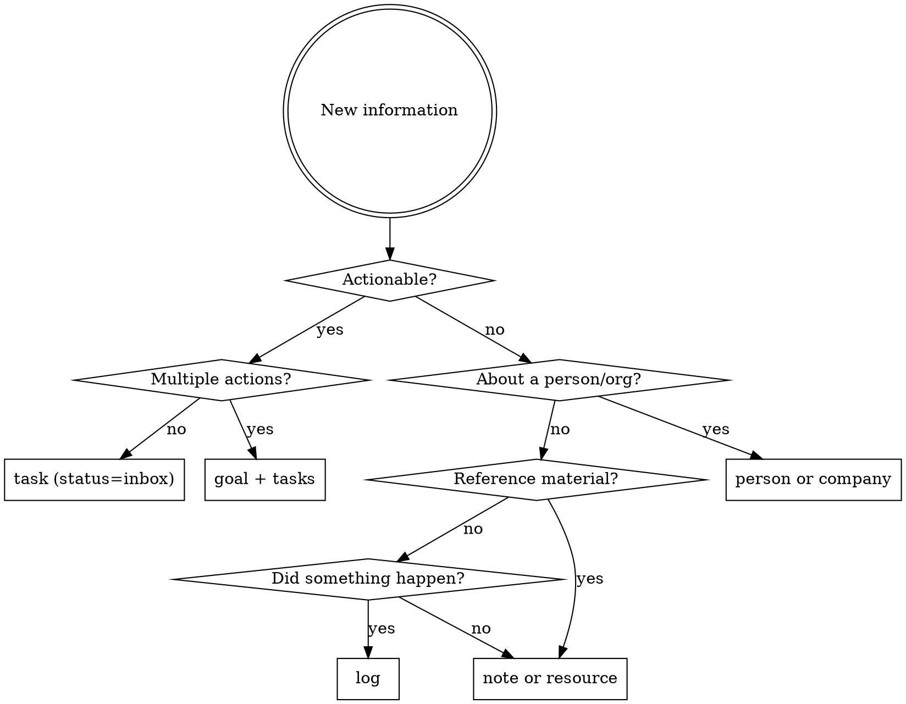

# Second Brain Protocol

## Overview

A Second Brain is a PARA+GTD knowledge vault stored in cortx. Every piece of information — tasks, goals, notes, resources, events — lives as a Markdown file with YAML frontmatter. This skill teaches what each entity type means and how to work with them correctly.

**8 entity types:** `area`, `goal`, `task`, `note`, `resource`, `log`, `person`, `company`

> **Schema dependency:** `goal` and `log` are new entity types, and `task` uses an extended status set (including `inbox`). These require an updated `types.yaml` to be deployed. Verify `cortx schema types` includes `goal` and `log` before using them.

## PARA Entity Map

| PARA Layer | cortx Entity | Meaning |
|---|---|---|
| **Projects** | `goal` (type_val=goal) | Finite outcome with a clear end state |
| **Projects** | `goal` (type_val=milestone) | Sub-outcome within a goal |
| **Projects** | `task` | Single next physical action within a goal |
| **Areas** | `area` | Ongoing life domain — no end date |
| **Resources** | `resource` | Reference material (link/video/file/image/doc/article) |
| **Resources** | `note` | Knowledge artifact (journal/meeting/research/etc.) |
| **Archive** | any entity | Set `status=archived` or `archived=true` |
| **People** | `person` | A contact — personal, professional, or family |
| **People** | `company` | An organization |
| **Timeline** | `log` | A timestamped event record |

**Life areas:** Health, Personal, Finance, Work, Family

## GTD Workflow in cortx

```
CAPTURE   → Create task with status=inbox (default)
CLARIFY   → Run clarify checklist (below) on each inbox item
ORGANIZE  → Assign goal, context, energy, state, priority; move status to open/someday/waiting
REFLECT   → Weekly review: clear inbox, review active goals, update last_reviewed
ENGAGE    → Filter by context+energy+state to find right task for right now
```

## Clarify Checklist

Run this internally on every inbox item before organizing it. Only ask the user when genuinely ambiguous.

1. **What is the very next physical action?** Rewrite the title if it's vague ("Budget" → "Call John re: Q2 budget")
2. **Is it actionable?** If no → note, resource, or log. If yes → continue.
3. **Does it require multiple actions?** If yes → create a goal, then break into tasks.
4. **Does it belong to an existing goal?** Search before creating a new one.
5. **Is there a deadline?** Set `due` or `end_date` if mentioned.
6. **What context, energy, and state does it need?** Set `context`, `energy`, `state`.
7. **Who is involved?** Set `assignee` if waiting; set `people` on related notes.

## Classification Decision Tree



## Entity Conventions

### area
- Ongoing responsibilities — never has a deadline
- Use `up` to nest sub-areas (e.g., "Exercise" under "Health")
- Set `archived=true` when no longer active — never delete
- Tags: broad domain labels

### goal
- The cortx entity **type** is always `goal`. The `type_val` field distinguishes goal vs milestone:
  - `type_val=goal` → top-level outcome ("Launch new product line")
  - `type_val=milestone` → sub-outcome; set `up` to parent goal
- `kind=time-bound` → must have `start_date` and `end_date`
- `kind=ongoing` → no dates required (e.g., "Maintain team morale")
- Always link to an `area`
- `last_reviewed` updated by JARVIS on each review
- `review_frequency` is always required — no default, must be set at creation

### task
- Title = concrete next physical action ("Call John about budget" not "Budget")
- Default `status=inbox` — everything is captured first, clarified later
- Clarify flow: `inbox` → `open` / `someday` / `waiting`
- `status=waiting` → set `assignee` to person you're waiting on
- `start_date` auto-set when → `in_progress`; `end_date` auto-set when → `done`
- `goal` is optional — null means unassigned inbox item (valid, not an error)
- Use `context` for GTD @context filtering
- Use `state` to match tasks to mental mode: easy/quick/flow

**State meanings:**
- `easy` — low cognitive load, autopilot
- `quick` — short burst, pairs with duration
- `flow` — requires deep uninterrupted focus

### note
- `kind` is structural (what type); tags are semantic (what it means)
- `status=draft` for newly captured; `status=done` for finalized knowledge
- `people` field: all people this note is about or who were present
- `insight`, `blocker`, `retrospective` → tags, not kinds
- Link to primary `area` and/or `goal`; use `related_*` for secondary connections

**Note kind meanings:**
| Kind | Use for |
|---|---|
| journal | Daily log, personal reflections |
| meeting | Notes from a meeting |
| people | CRM-style note about a person |
| project | Notes scoped to a goal |
| area | Notes scoped to a life area |
| research | Findings from investigation or web research |
| quick | Fleeting capture, raw inbox item |
| interview | Job or user interview notes |
| permanent | Zettelkasten evergreen note — atomic, refined idea |
| structure | Zettelkasten MOC — index linking related notes |

### resource
- `ref` holds the URL (for link/video/article) or file path (for file/image/document)
- Always set `kind` — agents use it to know how to handle the resource
- Link to primary `area` or `goal`

### log
- Records something that *happened* — timestamped, immutable in spirit
- `kind=decision` → body should capture the rationale
- `kind=risk` → body should capture the mitigation plan
- Log relations are unidirectional — logs reference parents, parents do not store logs
- Do NOT use logs for knowledge or insights — use notes with tags instead

### person / company
- Create person entities for anyone you reference more than once
- Link person to company via `company` field

## Relation Rules

**Primary link** (`goal`, `area`) = ownership. The entity *belongs* here.

**Related links** (`related_goals`, `related_notes`, `related_resources`, `related_areas`) = secondary connections. Relevant but not owned here. No inverse maintained.

**Rule:** Always set primary link first. Only add `related_*` for genuine cross-domain relevance.

**Log relations are reference-only:** When you write `goal=<id>` on a log, it creates a pointer from log → goal only. No inverse is maintained. Use queries to get a goal's timeline (see examples below).

**Querying relations:**
```bash
# All tasks for a goal (use bare titles — wikilink wrapping is transparent)
cortx query 'type = "task" and goal = "Q2 Planning"'

# All notes in an area
cortx query 'type = "note" and area = "Health"'

# Timeline for a goal
cortx query 'type = "log" and goal = "Q2 Planning"' --sort-by date:asc

# All milestones for a goal
cortx query 'type = "goal" and up = "Launch v2.0"'
```

## Tagging Philosophy

- `kind` = structural classification (schema-defined, mutually exclusive)
- `tags` = semantic labels (open vocabulary, combinable)
- Semantic tag examples: `urgent`, `waiting`, `blocker`, `insight`, `retrospective`, `decision`, `reference`
- Convention: lowercase, hyphenated (`action-item` not `Action Item`)

## Common Mistakes

| Mistake | Fix |
|---|---|
| Creating a task without checking for an existing goal | Search goals first |
| Setting insight/blocker/retrospective as `kind` | These are tags, not kinds |
| Creating a log entry for knowledge/thoughts | Knowledge → note; events → log |
| Setting `related_goals` instead of `goal` as primary | Use `goal` for ownership, `related_goals` for secondary |
| Skipping `kind` on notes and resources | Always set kind — agents use it to route information |
| Hard-deleting entities | Use `cortx archive "<title>"` or set `status=archived` |
| Leaving goal `kind=time-bound` without dates | Always set `start_date` and `end_date` for time-bound goals |
| Creating a goal without `review_frequency` | **Always ask for it — there is no default.** Prompt the user at creation time. |

---

# cortx Tool Reference

This skill provides the `cortx` tool for all vault operations. Use it for every create, read, update, delete, and query — never access vault files directly.

## Mental Model

**Vault:** A directory with entity files in type-specific folders. Each type's folder is defined in `types.yaml`.

**Entity:** A Markdown file with YAML frontmatter (typed fields: `type`, `status`, `tags`, etc.) and a freeform body. The `type` field links the file to its schema in `types.yaml`. The entity ID is derived from the filename stem — it is **not** stored in frontmatter.

**ID format:** Derived from `--title` via filesystem-safe sanitization — illegal chars (`/ \ : * ? " < > |` and control chars) become spaces, whitespace is collapsed, trailing dots are stripped, NFC-normalized. "Buy Groceries" → id=`Buy Groceries`, filename=`Buy Groceries.md`. Titles must be globally unique (case-insensitive) across the vault. Create fails on collision; the user must choose a different title. Override with `--id`, but the value is still sanitized.

**Links:** Entities reference each other via `link` fields. Values are stored as Obsidian wikilinks (`goal: "[[Q2 Planning]]"`) so they render as clickable links in Obsidian. cortx wraps on write and unwraps on read — callers always use bare titles. Create and update verify that the target exists before writing (use `--no-validate-links` to bypass). Bidirectional link fields automatically update the inverse field on the referenced entity.

## Command Reference

**CRUD:**

| Command | Purpose | Key Flags |
|---------|---------|-----------|
| `create <type> --title "..." [--set k=v]` | Create entity | `--id`, `--name`, `--tags`, `--set`, `--no-validate-links` |
| `show "<title>"` | Display entity | |
| `update "<title>" --set k=v` | Update fields (title changes rejected — use rename) | `--set` (repeatable), `--no-validate-links` |
| `archive "<title>"` | Soft delete (status=archived) | |
| `delete "<title>" --force` | Hard delete | `--force` required |
| `rename "<old>" "<new>"` | Rename entity + cascade all back-refs | `--dry-run`, `--skip-body` |

**Query & Aggregation:**

| Command | Purpose | Key Flags |
|---------|---------|-----------|
| `query '<expr>'` | Filter entities | `--sort-by`, `--format` |
| `meta distinct <field>` | Unique field values | `--where '<expr>'` |
| `meta count-by <field>` | Group counts | `--where '<expr>'` |

**Note Editing:**

| Command | Purpose | Key Flags |
|---------|---------|-----------|
| `note headings <id>` | List headings | |
| `note insert-after-heading <id>` | Insert after heading | `--heading`, `--content` |
| `note replace-block <id>` | Replace named block | `--block-id`, `--content` |
| `note read-lines <id>` | Read line range | `--start`, `--end` |

**Schema Introspection:**

| Command | Purpose | Key Flags |
|---------|---------|-----------|
| `schema types` | List all entity types in the vault | `--format json` |
| `schema show <type>` | Show fields, types, required, defaults for a type | `--format json` |
| `schema validate` | Check `types.yaml` ref integrity and relation consistency | |

**Maintenance:**

| Command | Purpose |
|---------|---------|
| `doctor validate` | Validate all entity files against schemas |
| `doctor links [--fix]` | Check bidirectional relation consistency; `--fix` auto-repairs missing inverses |
| `doctor filenames [--fix] [--check-bodies]` | Check filename/title drift, case collisions, wikilink format |

## Query Language

**All string values MUST be double-quoted.** Unquoted strings will cause parse errors.

| Operator | Syntax | Example |
|----------|--------|---------|
| Equal | `field = "value"` | `status = "open"` |
| Not equal | `field != "value"` | `status != "done"` |
| Less than | `field < value` | `due < today` |
| Less/equal | `field <= value` | `scheduled <= today` |
| Greater than | `field > value` | `due > "2026-01-01"` |
| Greater/equal | `field >= value` | `created_at >= "2026-03-01"` |
| Contains | `field contains "value"` | `tags contains "urgent"` |
| In | `field in ["a", "b"]` | `status in ["open", "waiting"]` |
| Between | `field between ["start", "end"]` | `due between ["2026-04-01", "2026-04-30"]` |
| Text search | `text ~ "pattern"` | `text ~ "meeting notes"` |
| And / Or / Not | `expr and expr` | `status = "open" and due < today` |

`today` resolves to current date. Parentheses group expressions: `(a or b) and c`.

## Sort Order

Use `--sort-by` on queries to order results. Format: `field[:order][,field[:order]...]`. Order defaults to `asc`.

**Null/missing values always sort to the end**, regardless of ascending or descending order.

## Recipes

**Filter by type and status:**
```
# Overdue
query 'type = "task" and status != "done" and due < today'

# Scheduled for today or earlier
query 'type = "task" and status = "open" and scheduled <= today'

# Entities linked to a specific parent (use bare title)
query 'type = "task" and goal = "Q2 Planning"'
```

**Discovery:**
```
# Entities with a specific tag
query 'tags contains "urgent"'

# Entities created this month
query 'created_at >= "2026-04-01"'

# Full-text search
query 'text ~ "quarterly review"'
```

**Aggregation:**
```
# Distinct values for a field
meta distinct status --where 'type = "task"'

# Entity count by type
meta count-by type

# Entity count grouped by status
meta count-by status --where 'type = "task"'
```

**CRUD flow:**
```
# Create — ID derived from sanitized title, written as "Review PR.md"
create task --title "Review PR" --set goal="Q2 Planning" --set due=2026-04-05 --tags "urgent,review"

# Update a field (reference by title)
update "Review PR" --set status=in_progress

# Archive
archive "Review PR"

# Rename (cascades to all back-references)
rename "Review PR" "Review Q2 PR"
```

**Goal management:**
```
# Create a time-bound goal
create goal --title "Launch v2.0" --set type_val=goal --set kind=time-bound --set status=active --set area="Product" --set start_date=2026-04-01 --set end_date=2026-06-30 --set priority=high

# Create a milestone under a goal (reference parent by title)
create goal --title "Complete backend API" --set type_val=milestone --set kind=time-bound --set up="Launch v2.0" --set start_date=2026-04-01 --set end_date=2026-04-30

# All active goals
query 'type = "goal" and status = "active"' --sort-by end_date:asc

# Tasks for a goal
query 'type = "task" and goal = "Launch v2.0"' --sort-by priority:desc
```

**Task inbox and state-based filtering:**
```
# Capture to inbox
create task --title "Call John about budget" --set status=inbox

# View inbox
query 'type = "task" and status = "inbox"'

# Clarify: move to open with GTD fields (reference by title)
update "Call John about budget" --set status=open --set context=computer --set state=flow --set priority=high

# Quick wins
query 'type = "task" and status = "open" and state = "quick"' --sort-by duration:asc

# Deep focus tasks
query 'type = "task" and status = "open" and state = "flow"' --sort-by priority:desc
```

**Log / timeline:**
```
# Record a decision (reference parent goal by title)
create log --title "Decided to migrate to Rust" --set kind=decision --set date=2026-04-04 --set impact=positive --set goal="Launch v2.0"

# Timeline for a goal
query 'type = "log" and goal = "Launch v2.0"' --sort-by date:asc
```

**Note editing:**
```
# List headings
note headings "Review Q2 Goals"

# Insert after heading
note insert-after-heading "Review Q2 Goals" --heading "Progress" --content "- Completed initial review"

# Replace a named block
note replace-block "Review Q2 Goals" --block-id summary --content "Updated summary text"
```

**Relation maintenance:**
```
# Check for broken links
doctor links

# Auto-repair missing inverses
doctor links --fix
```
