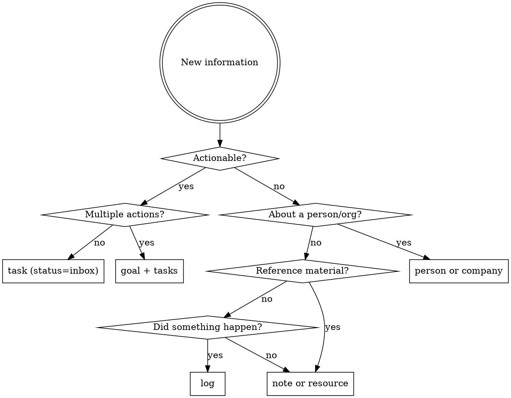

# Second Brain Protocol

## Overview

A Second Brain is a PARA+GTD knowledge vault stored in cortx. Every piece of information — tasks, goals, notes, resources, events — lives as a Markdown file with YAML frontmatter. This skill teaches what each entity type means and how to work with them correctly.

**8 entity types:** `area`, `goal`, `task`, `note`, `resource`, `log`, `person`, `company`

> **Schema dependency:** `goal` and `log` are new entity types, and `task` uses an extended status set (including `inbox`). These require an updated `types.yaml` to be deployed. Verify `cortx schema types` includes `goal` and `log` before using them.

## PARA Entity Map

| PARA Layer | cortx Entity | Meaning |
|---|---|---|
| **Projects** | `goal` (type_val=goal) | Finite outcome with a clear end state |
| **Projects** | `goal` (type_val=milestone) | Sub-outcome within a goal |
| **Projects** | `task` | Single next physical action within a goal |
| **Areas** | `area` | Ongoing life domain — no end date |
| **Resources** | `resource` | Reference material (link/video/file/image/doc/article) |
| **Resources** | `note` | Knowledge artifact (journal/meeting/research/etc.) |
| **Archive** | any entity | Set `status=archived` or `archived=true` |
| **People** | `person` | A contact — personal, professional, or family |
| **People** | `company` | An organization |
| **Timeline** | `log` | A timestamped event record |

**Life areas:** Health, Personal, Finance, Work, Family

## GTD Workflow in cortx

```
CAPTURE   → Create task with status=inbox (default)
CLARIFY   → Run clarify checklist (below) on each inbox item
ORGANIZE  → Assign goal, context, energy, state, priority; move status to open/someday/waiting
REFLECT   → Weekly review: clear inbox, review active goals, update last_reviewed
ENGAGE    → Filter by context+energy+state to find right task for right now
```

## Clarify Checklist

Run this internally on every inbox item before organizing it. Only ask the user when genuinely ambiguous.

1. **What is the very next physical action?** Rewrite the title if it's vague ("Budget" → "Call John re: Q2 budget")
2. **Is it actionable?** If no → note, resource, or log. If yes → continue.
3. **Does it require multiple actions?** If yes → create a goal, then break into tasks.
4. **Does it belong to an existing goal?** Search before creating a new one.
5. **Is there a deadline?** Set `due` or `end_date` if mentioned.
6. **What context, energy, and state does it need?** Set `context`, `energy`, `state`.
7. **Who is involved?** Set `assignee` if waiting; set `people` on related notes.

## Classification Decision Tree



## Entity Conventions

### area
- Ongoing responsibilities — never has a deadline
- Use `up` to nest sub-areas (e.g., "Exercise" under "Health")
- Set `archived=true` when no longer active — never delete
- Tags: broad domain labels

### goal
- The cortx entity **type** is always `goal`. The `type_val` field distinguishes goal vs milestone:
  - `type_val=goal` → top-level outcome ("Launch new product line")
  - `type_val=milestone` → sub-outcome; set `up` to parent goal
- `kind=time-bound` → must have `start_date` and `end_date`
- `kind=ongoing` → no dates required (e.g., "Maintain team morale")
- Always link to an `area`
- `last_reviewed` updated by JARVIS on each review
- `review_frequency` is always required — no default, must be set at creation

### task
- Title = concrete next physical action ("Call John about budget" not "Budget")
- Default `status=inbox` — everything is captured first, clarified later
- Clarify flow: `inbox` → `open` / `someday` / `waiting`
- `status=waiting` → set `assignee` to person you're waiting on
- `start_date` auto-set when → `in_progress`; `end_date` auto-set when → `done`
- `goal` is optional — null means unassigned inbox item (valid, not an error)
- Use `context` for GTD @context filtering
- Use `state` to match tasks to mental mode: easy/quick/flow

**State meanings:**
- `easy` — low cognitive load, autopilot
- `quick` — short burst, pairs with duration
- `flow` — requires deep uninterrupted focus

### note
- `kind` is structural (what type); tags are semantic (what it means)
- `status=draft` for newly captured; `status=done` for finalized knowledge
- `people` field: all people this note is about or who were present
- `insight`, `blocker`, `retrospective` → tags, not kinds
- Link to primary `area` and/or `goal`; use `related_*` for secondary connections

**Note kind meanings:**
| Kind | Use for |
|---|---|
| journal | Daily log, personal reflections |
| meeting | Notes from a meeting |
| people | CRM-style note about a person |
| project | Notes scoped to a goal |
| area | Notes scoped to a life area |
| research | Findings from investigation or web research |
| quick | Fleeting capture, raw inbox item |
| interview | Job or user interview notes |
| permanent | Zettelkasten evergreen note — atomic, refined idea |
| structure | Zettelkasten MOC — index linking related notes |

### resource
- `ref` holds the URL (for link/video/article) or file path (for file/image/document)
- Always set `kind` — agents use it to know how to handle the resource
- Link to primary `area` or `goal`

### log
- Records something that *happened* — timestamped, immutable in spirit
- `kind=decision` → body should capture the rationale
- `kind=risk` → body should capture the mitigation plan
- Log relations are unidirectional — logs reference parents, parents do not store logs
- Do NOT use logs for knowledge or insights — use notes with tags instead

### person / company
- Create person entities for anyone you reference more than once
- Link person to company via `company` field

## Relation Rules

**Primary link** (`goal`, `area`) = ownership. The entity *belongs* here.

**Related links** (`related_goals`, `related_notes`, `related_resources`, `related_areas`) = secondary connections. Relevant but not owned here. No inverse maintained.

**Rule:** Always set primary link first. Only add `related_*` for genuine cross-domain relevance.

**Log relations are reference-only:** When you write `goal=<id>` on a log, it creates a pointer from log → goal only. No inverse is maintained. Use queries to get a goal's timeline (see examples below).

**Querying relations:**
```bash
# All tasks for a goal
cortx query 'type = "task" and goal = "goal-20260404-abc12345"'

# All notes in an area
cortx query 'type = "note" and area = "area-20260404-def67890"'

# Timeline for a goal
cortx query 'type = "log" and goal = "goal-20260404-abc12345"' --sort-by date:asc

# All milestones for a goal
cortx query 'type = "goal" and up = "goal-20260404-abc12345"'
```

## Tagging Philosophy

- `kind` = structural classification (schema-defined, mutually exclusive)
- `tags` = semantic labels (open vocabulary, combinable)
- Semantic tag examples: `urgent`, `waiting`, `blocker`, `insight`, `retrospective`, `decision`, `reference`
- Convention: lowercase, hyphenated (`action-item` not `Action Item`)

## Common Mistakes

| Mistake | Fix |
|---|---|
| Creating a task without checking for an existing goal | Search goals first |
| Setting insight/blocker/retrospective as `kind` | These are tags, not kinds |
| Creating a log entry for knowledge/thoughts | Knowledge → note; events → log |
| Setting `related_goals` instead of `goal` as primary | Use `goal` for ownership, `related_goals` for secondary |
| Skipping `kind` on notes and resources | Always set kind — agents use it to route information |
| Hard-deleting entities | Use `cortx archive <id>` or set `status=archived` |
| Leaving goal `kind=time-bound` without dates | Always set `start_date` and `end_date` for time-bound goals |
| Creating a goal without `review_frequency` | **Always ask for it — there is no default.** Prompt the user at creation time. |
